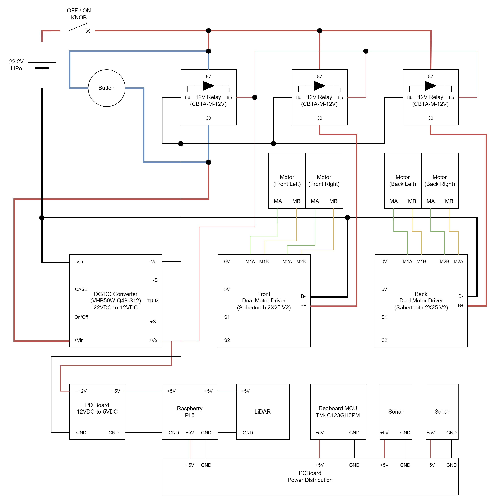
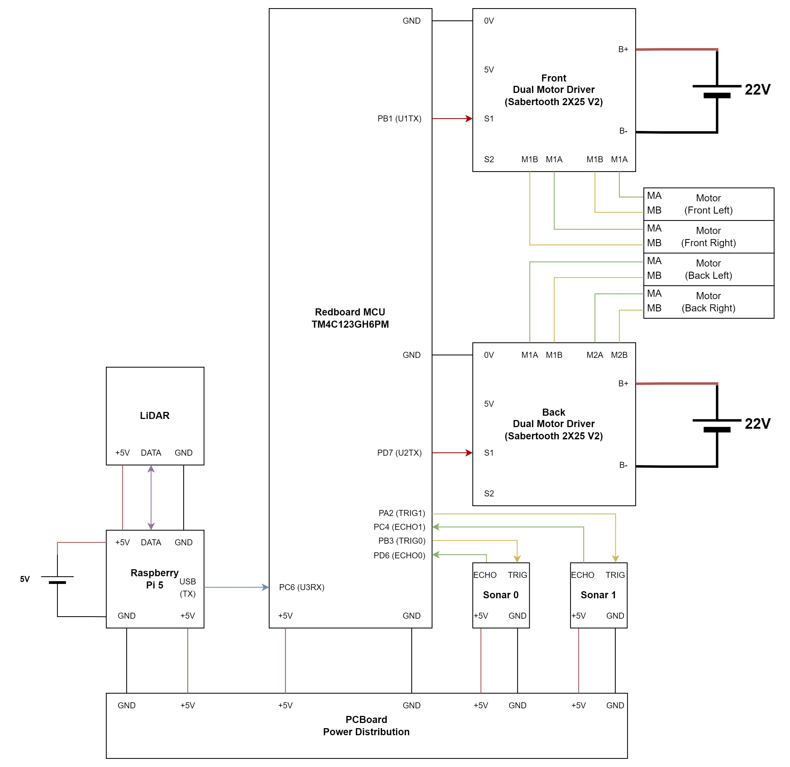

# Roambot Project Overview

This repository contains all the documentation, source code, and configuration files required for building, testing, and deploying the Roambot autonomous mobile robot.

## Project Structure:

### 1. **datasheets/**  
Contains hardware documentation, pinouts, electrical characteristics, programming info, and datasheets for all major components used in the rover. This folder is essential for understanding low-level hardware specifications and integration.

### 2. **documentation/**  
Stores team-generated engineering documents including:
- **PC** (Project Charter)
- **SRS** (System Requirements Specification)
- **ADS** (Architectural Design Specification)
- **DDS** (Detailed Design Specification)
- **Diagrams** Includes wiring diagrams and power architecture.

These documents define the system design, planning, and requirements for Roambot.

### 3. **pi/**  
Hosts all the ROS 2-related code and scripts that run on the Raspberry Pi 5. Includes:
- Custom ROS 2 packages
- ROS 2 installation and build scripts
- Shell scripts for testing individual subsystems like LiDAR, odometry, and full navigation
- Serial and GPIO tests for communication with the Redboard MCU

### 4. **redboard/**  
Contains source code for the Redboard microcontroller. This code is compiled using Code Composer Studio (CCS) and controls low-level motor operations and serial communication with the Raspberry Pi.

### 5. **ros2_roam_bot/**  
Contains the ROS 2 simulation for Roambot. This folder includes the configuration and setup files to simulate the Roambot's movements and operations in a virtual environment, allowing for testing and debugging without the physical hardware.

---

This top-level structure ensures separation of concerns between documentation, Pi-side ROS operations, and MCU control logic, as well as providing tools for simulation and testing.

## Diagrams

### Power System

### Pin Connections

## 📽️ Roambot Demo Video

